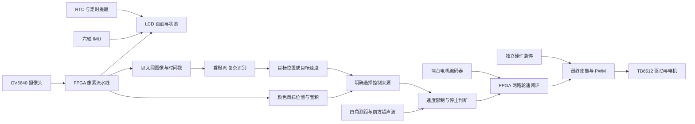
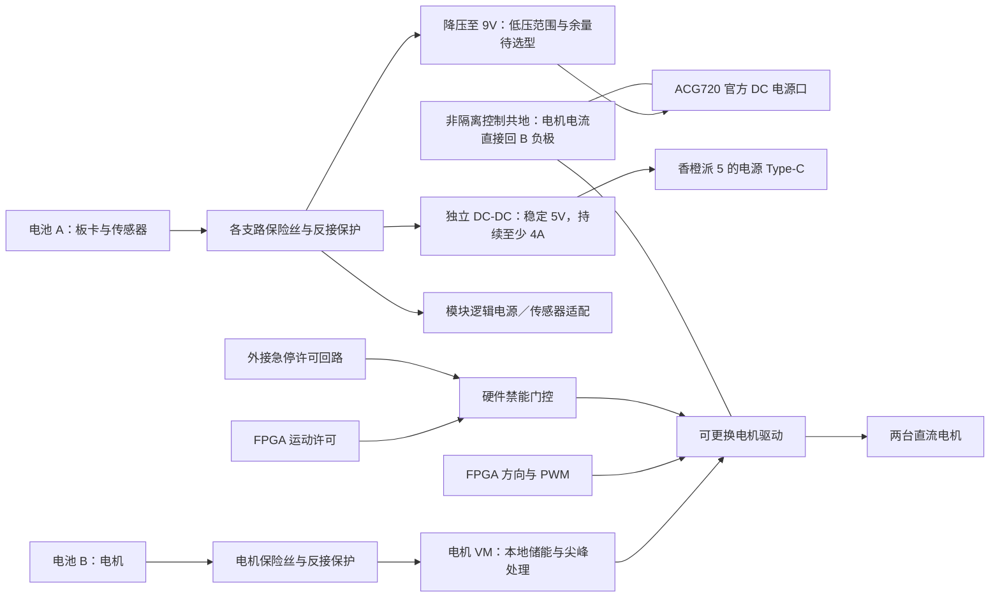
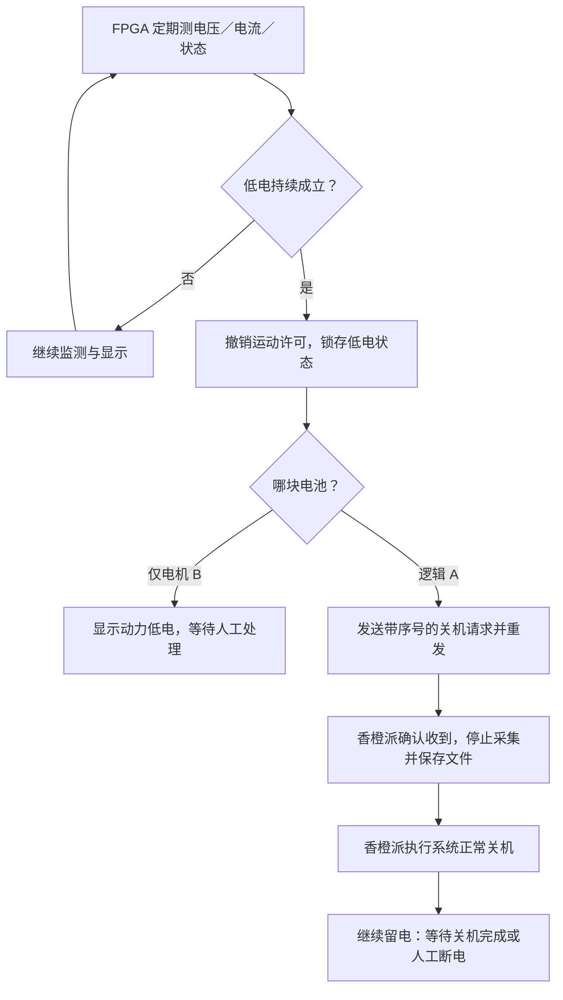

# FPGA 小车扩展板与功能规划

日期：2026-10-04。目标板：ACG720，GW5AT-60B。当前显示屏固定为 1024×600 RGB LCD，摄像头为官方 OV5640。已审阅 TOF200C、CS100A 超声波资料和所提供的 IMU 例程，并核对 TB6612 原厂手册。本次纠正了激光接口假设：**TOF200C 是 VL53L0X 的 I²C 模块，不是 UART 模块。**本文给出 FPGA 信号分配和电路设计方案；模块排针顺序、实际电平和电机电流尚未全部确认，不能直接按此通电接线。

## 1. 先说清楚：为什么使用 FPGA

如果目标只是“摄像头识别人，香橙派算结果，下位机驱动两台电机”，香橙派直接连接摄像头和屏幕、配合 STM32，完全是合理方案。不能把绕经 FPGA 的显示、网口转发或多接几个传感器本身当成优势。STM32 也有硬件 PWM、编码器计数和定时器，见 [ST 定时器文档](https://wiki.st.com/stm32mpu/wiki/TIM_internal_peripheral)。

比赛要求以 FPGA 为主体，这决定了我们要研究 FPGA 能承担什么，并不证明它一定是这类消费产品的成本最优解。要区分“适合研究和比赛”“系统中确有作用”和“市场上最划算”。闹钟、音箱和更多接口可以增加实用性，不能代替性能证据。

建议将主线改为：**FPGA 能独立完成简单视觉任务和移动闭环，香橙派增加复杂的目标识别能力。**不是预先宣称比其他方案快，而是先做出可测量的硬件处理路径。

| 候选能力 | FPGA 具体做什么 | 实际用途与限制 |
| --- | --- | --- |
| 简单目标定位 | 对摄像头像素做颜色分割，统计目标区域、面积、中心位置 | 可跟随颜色标记、定位红色目标；不能把“红色区域”称作“识别了水瓶”，也不能保证在杂乱背景中正确选中目标 |
| 独立跟随闭环 | 目标水平偏差产生转向意图，前方测距限制速度，两路编码器反馈轮速 | 在不依赖香橙派视觉推理的模式下运行；目标丢失、数据过期时停止，而不是盲走 |
| 并行执行 | 像素处理、编码器计数、各传感器接口、PWM、LCD、网络各自运行 | 是否在视频/网络满负载时仍保持控制周期，需要实测；不是 MCU 不能并行，也不是零延迟 |
| 图像与传感器时间对应 | 给帧、距离、轮速打统一时间戳，记录数据有效性 | 帮助判断目标画面和障碍物距离是不是同一时刻附近的数据；传感器内部测量周期仍由模块决定 |
| 输出仲裁 | 识别结果不能直接绕过急停、测距异常和速度上限驱动电机 | 与独立硬件禁能结合，提高失联时行为的可预测性；这也是 MCU 可做的功能，不单独作为 FPGA 独有优势 |

现有高斯滤波是实际像素流水线，可以继续复用。但为了检测效果而不断叠加滤波不一定有益：用于 AI 的彩色图像和用于硬件颜色定位/调试的分支应明确区分，并记录处理配置。颜色阈值应在实拍光照下标定。

800×480、30 帧/秒的 RGB565 有效图像数据为 23.04 MB/s；400×240、30 帧/秒为 5.76 MB/s，未计空白和协议开销。这是计算示例，不是当前所有链路的实测吞吐。逐像素流水线是 FPGA 值得研究的部分，数值不能证明它已经超过香橙派或某款 STM32。

建议系统关系如下（Typora 可开启 Mermaid 渲染）：

硬件颜色模式只在明确选择并启动后运行。香橙派模式下，指令超时就停止；不能因网络断开而自动切换到另一个运动来源。切换模式、释放急停和重新上电都应重新确认启动。

## 2. 如何证明价值，避免自欺欺人

先给出测试条件和结果，再写性能结论。建议记录以下项目：

| 测试 | 要记录什么 | 能说明什么 |
| --- | --- | --- |
| 颜色定位路径 | 从曝光/帧到坐标输出的时序、帧率、错误选中情况 | FPGA 是否真正承担定位计算。逐帧面积/中心统计通常要等帧结束，不能声称微秒级完整识别 |
| 控制周期 | 例如以 1 kHz 作为初始设计目标，记录轮速控制更新间隔和抖动 | 固定周期控制是否实现；1 kHz 不保证机械系统有相同响应速度，参数需实测调节 |
| 并发负载 | 视频+网口打开/关闭时的编码器丢计数、控制周期、轮速误差 | 这些硬件模块运行是否受到图像负载影响 |
| 停止行为 | 有效障碍事件/指令超时到 PWM 与使能变化，以及车轮实际停下的时间 | 数字输出停止与机械刹停是两种指标；传感器采样周期、惯性、驱动状态都影响后者 |
| 对照方案 | 同摄像头、同算法、同分辨率、同功耗/成本统计方法 | 若要宣称优于香橙派或 STM32，必须有可比实测；只展示本方案不够 |

目前没有上述对照数据，所以只可描述设计和已实现的功能。即使测试后发现 MCU 同样能胜任，也应如实报告。项目仍可以展示硬件流水线、资源开销和可预测控制，但不夸大性价比。

## 3. 40＋4＋8＋16 不是 68 个数字 GPIO

依据官方《ACG720-138&60K通用原理图》第 1、3、7、8、11、12、15 页，以及《高云 ACG720-138&60K通用管脚分配表.xlsx》Sheet1 GPIO0 的 A219:F254。接插件总脚数包含电源、地、模拟信号和未连接脚。

| 接口 | 实际信号 | 扩展板处理 |
| --- | --- | --- |
| P7，40 针 | 36 个 GPIO、5V、3V3、两个 GND | 作为主要数字接口，36 根信号全部保留直通/测试点 |
| P3，4 针 | 两路 DAC 模拟输出、两个 AGND | 单独标为模拟输出，不接数字传感器或电机 |
| P5，16 针 | 八路 ADC 模拟输入、八个 AGND | 每路按“模拟输入＋AGND”分组；需要分压/放大/保护的前端另画 |
| P8，8 针 | USER0/1/2、5V、3V3、两个 GND、一根未标功能脚 | 可预留连接器，不将未知脚计入本期可用 IO |
| P6，8 针 | GPIO Bank 的 VCCIO 电压选择跳帽 | 保留选择功能，不当传感器接插件 |

P8 按原理图为：1=5V，2=GND，3=USER0，4=USER2，5=USER1，6=未标功能，7=3V3，8=GND。USER2 可见 H20；USER0/1 的 FPGA 端映射尚未可靠核实，本期不使用。第 6 脚不是可随意分配的 IO。

**纠正旧说明：本版官方资料中，P7 GPIO0 在 BANK2，HDMI 在 BANK7，球位没有重叠。此前“GPIO0 与 HDMI 共用”的说法没有依据，应撤回。**同时使用时仍要计算时钟、逻辑资源和视频带宽，但不存在已发现的这两组球位冲突。

GPIO0 的电压不是固定 3.3V：BANK2 的 VCCO_2 接 VCCIO，P6 可选 3.3/2.5/1.8/1.5V。按图 P6 的 7—8 跳帽选择 3.3V；实物 Pin1 方向、板卡修订和跳帽位置还需确认，并用万用表核对 TP5。软件设置 LVCMOS33 不会把错误的硬件供电自动变成 3.3V。

## 4. 本期信号预算与 P7 建议分配

四个 TOF200C 共用一组 I²C，四路 XSHUT 独立控制，先轮询数据、不接四路 GPIO1 中断。前提是实物确实引出 XSHUT，见第 11 节。你已确认 IMU 实物为 LSM6DSV16X，更正后的例程也使用它的 I²C＋中断；编码器按 A/B 预留。按你们已有电赛运行经验，本期继续采用 MG513 系列电机＋TB6612。最新加入两块电池监测，共用一组独立 I²C（第 13 节），默认轮询，报警脚可选。这张表确定 FPGA 侧用途，模块侧线序、电源和保护还要落实。

| 功能 | 数字信号数 |
| --- | ---: |
| 四个 TOF，共用 SCL/SDA＋四路 XSHUT | 6 |
| 超声波 TRIG/ECHO | 2 |
| 六轴 IMU SCL/SDA/INT | 3 |
| TB6612 两路 PWM、四路方向、STBY | 7 |
| 两台电机 A/B 编码器 | 4 |
| 外接急停反馈 | 1 |
| 调试串口 TX/RX | 2 |
| 两块电池监测，共用独立 I²C | 2 |
| 本期合计 | **27** |
| 两个步进驱动器 STEP/DIR/EN 预留 | 6 |
| 预留后合计 | **33，剩余 3** |
| 可选：两路 INA226 ALERT | 2 |
| 包含可选 ALERT 与两轴步进预留 | **35，剩余 1** |

如果采用两路普通 PWM 舵机，控制只占两根数字 IO，电源/地不算 IO，包含电池监测共 29 根，未计可选 ALERT。若 TOF 没有可用 XSHUT，四组独立 I²C 占 8 根测距信号，电池总线需移到两个备用脚；本期 29 根，加两个步进驱动器为 35 根、剩 1 根，不能再同时塞入两路 ALERT。必须重新映射，不按两个方案同时接线。舵机与步进驱动器不是同一种接线，预留口需适配。四角测距不等于完整环境建图，六轴 IMU 也不能提供不漂移的绝对航向。

**P7 已与当前 lcd_interaction.cst 逐项核对，下面 36 根球位没有被 LCD、GT911、摄像头、DDR3、网口和 LED 占用。**这不替代实物接插件方向和电气检查。不要套用其他板卡“1/2 是电源”的规则：本板电源在 11/12 和 29/30。

调试 TX/RX 名称从 FPGA 角度看；I²C 的 SDA 为双向开漏，SCL 也按开漏释放/拉低实现，不能用推挽方式互相顶电平。XSHUT 的“拉低/释放”应经过符合模块电压的电路，不等于直接输出 3.3V 高电平。

| P7 脚 | GPIO0 | 60K 球位 | 建议用途 |
| ---: | ---: | --- | --- |
| 1 | 0 | A13 | 四个 TOF 共用 SCL |
| 2 | 1 | A14 | 四个 TOF 共用 SDA |
| 3 | 2 | A15 | TOF 1 XSHUT 控制 |
| 4 | 3 | A16 | TOF 2 XSHUT 控制 |
| 5 | 4 | A18 | TOF 3 XSHUT 控制 |
| 6 | 5 | A19 | TOF 4 XSHUT 控制 |
| 7 | 6 | F13 | 电池监测共用 SCL |
| 8 | 7 | F14 | 电池监测共用 SDA |
| 9 | 8 | E13 | 超声波 TRIG |
| 10 | 9 | E14 | 超声波 ECHO，电平待确认 |
| 11 | — | — | 板载 5V，不能当信号脚 |
| 12 | — | — | GND |
| 13 | 10 | C13 | IMU SCL |
| 14 | 11 | B13 | IMU SDA |
| 15 | 12 | D14 | IMU INT，LSM 方案暂选 INT2 |
| 16 | 13 | D15 | TB6612 AIN1 |
| 17 | 14 | C14 | TB6612 AIN2 |
| 18 | 15 | C15 | TB6612 PWMA |
| 19 | 16 | B15 | TB6612 BIN1 |
| 20 | 17 | B16 | TB6612 BIN2 |
| 21 | 18 | D17 | TB6612 PWMB |
| 22 | 19 | C17 | 运动许可请求，经硬件急停门控后到 TB6612 STBY |
| 23 | 20 | E16 | 左轮编码器 A |
| 24 | 21 | D16 | 左轮编码器 B |
| 25 | 22 | B17 | 右轮编码器 A |
| 26 | 23 | B18 | 右轮编码器 B |
| 27 | 24 | C18 | 硬件急停反馈 |
| 28 | 25 | C19 | 调试 FPGA_TX |
| 29 | — | — | 板载 3V3，不能当信号脚 |
| 30 | — | — | GND |
| 31 | 26 | F16 | 调试 FPGA_RX |
| 32 | 27 | E17 | 云台轴 1 STEP，或舵机 PWM |
| 33 | 28 | D20 | 云台轴 1 DIR，或预留 |
| 34 | 29 | C20 | 云台轴 1 EN，或预留 |
| 35 | 30 | E19 | 云台轴 2 STEP，或舵机 PWM |
| 36 | 31 | D19 | 云台轴 2 DIR，或预留 |
| 37 | 32 | F18 | 云台轴 2 EN，或预留 |
| 38 | 33 | E18 | 备用：电池 A ALERT，或限位 |
| 39 | 34 | F19 | 备用：电池 B ALERT，或限位 |
| 40 | 35 | F20 | 备用：例如独立驱动器故障输入 |

TB6612 不提供一个可任意假定的 FAULT 引脚；表中备用 3 仅适用于将来确实有故障输出的其他驱动器。方向、电机停止方式和禁能时序应按实际模块设计。

## 5. 扩展板怎样分组，方便接线和迭代

第一版采用“信号转接＋电平适配＋接插件＋电源分配”，沿用已买的 TB6612 成品模块，驱动座保留可拆换，不自行重画功率驱动器。P7 全部 IO 直通到标号清楚的测试/备用位置，再分到有用途的 4Pin/6Pin 接口。两处接插件连着同一信号不等于增加了一个 IO，不能同时接两个主动输出。

| 接口组 | 建议接插件 | 信号分组，尚非模块线序 |
| --- | --- | --- |
| 四角 TOF ×4 | 每路 6Pin 防反插 | 模块供电、GND、共用 SCL、共用 SDA、本路 XSHUT、GPIO1 预留 |
| 两路电池监测 | 总线 4Pin＋ALERT 可选焊盘；动力另走大电流端子 | 3V3、GND、SCL、SDA；电池电流不流经此 4Pin |
| 正前方超声波 | 4Pin 防反插 | 模块供电、GND、TRIG、ECHO |
| IMU | 6Pin | 模块供电、GND、SCL、SDA、INT、NC/待定；LSM 的 CS/地址脚在适配处设定，不虚构 RESET |
| 左/右编码器 ×2 | 每路 4Pin | 编码器供电、GND、A、B；电机功率线另走端子 |
| TB6612 左/右控制 | 两组 6Pin 或一个与模块一致的转接座 | 每组逻辑供电、GND、IN1、IN2、PWM、公共 STBY；同一 STBY 只有一个 FPGA 信号 |
| 两轴云台预留 | 每轴 6Pin | 信号侧供电、GND、STEP、DIR、EN、NC；舵机使用单独适配口和电源 |
| 调试串口 | 4Pin | GND、FPGA_TX、FPGA_RX、NC；避免 USB 串口电源向板卡倒灌 |
| 硬件急停 | 4Pin 或适配实际开关的端子 | 硬件禁能回路和状态反馈回路；按选定开关触点定义线序 |
| ADC | 八组 2Pin，可组织成四组 4Pin | 每路模拟输入与 AGND，明确 0～3.3V 范围 |
| DAC | 一组 4Pin | 两路模拟输出及各自 AGND；不做大电流驱动 |

这些是功能分组，**不是商家模块上从左到右的排针顺序**。尤其 TOF 尺寸图只有六个孔，没有写六针功能，不能凭孔数猜线序。确认模块后，接线表必须写全“模块脚 → 电平转换/保护 → 扩展板连接器脚 → P7 脚 → FPGA 球位 → Bank 电压 → 上电默认状态”。不能只写信号名而省略方向。

布局建议：P7 接口和逻辑电路靠近板卡，测距/IMU 接口在一侧，电机电源/驱动/电机端子在另一侧，模拟输入前端避开电机开关电流。避免电机回流穿过 FPGA 或模拟参考地的细线；同时保证需要的共同参考地连续可靠，不能盲目切割地平面。逐项确定连接器间距、正反插方向和安装孔，留出 LCD、摄像头、网线和 SD 插拔空间。

供电、电平须在画原理图前确认：

- FPGA GPIO 不直接接未知的 5V 输出；超声波 ECHO、编码器、TOF 的 I²C/XSHUT/GPIO1 都要确认电平。I²C 要核对模块上拉电阻接在哪个电压上，多块模块并联还要计算等效上拉。
- TB6612 的 VM 是电机电源，VCC 是逻辑电源，两者分清。原厂输入高电平门限为 0.7×VCC；如果 VCC=5V，FPGA 3.3V 不保证被识别，见 [TB6612FNG 原厂手册](https://toshiba.semicon-storage.com/info/docget.jsp?did=10660)。采用 3.3V 逻辑还是电平转换，要看实际模块。
- 电机、舵机供电独立核算，不从 FPGA 排针给大电流负载供电。根据电机堵转电流检查驱动器、导线、接插件、电源和保护器件，不能只看空载额定值。
- 默认使能应为关闭，FPGA 未配置、复位或没有有效命令时也不能运动。硬件急停应能直接撤销驱动许可，不能只依赖 LCD 按钮或串口命令。撤销 STBY 与主动电制动效果不同，实际停车距离要测试。
- 你目前没有万用表，画图和资料核对可以先做，接线和上电前需要借用或准备一块，检查电源、电平和短路。

## 6. 开关、LED、按键和 LCD 怎么发挥作用

不要做“每个开关对应一种随意效果”的功能拼盘，围绕测试、模式和故障解释来用。这些板载资源使用自身的固定连接，不需要占用 P7 的新传感器信号。

| 板载资源 | 建议用途 |
| --- | --- |
| SW0 | 允许运动开关，关闭则禁止运动；不是替代硬件急停 |
| SW1 | FPGA 简单视觉模式 / 香橙派识别模式；切换后重新确认启动 |
| SW2～SW3 | 调试预览选择：原图、灰度、高斯、边缘。AI 发送分支配置需单独记录，不能随意跟着预览改变 |
| SW4 | 图像标记/传感器数值叠加 |
| SW5 | 台架低速限制模式 |
| SW6 | 事件/时序记录开关 |
| SW7 | 定时提醒开关；不设置“关闭安全保护”的开关 |
| S0 | 保留当前全局复位功能 |
| S4 | 保留当前高斯切换功能；之后若改变，应更新 UI、说明和数据配置 |
| S1～S3 | 后续开始/暂停、菜单确认、取消/提醒消音，长短按去抖；具体映射待界面确定 |
| D0～D7 | 后续显示心跳、相机、DDR、通信数据有效、测距有效、轮速控制、目标有效、停止/故障 |

上述是规划，当前 R4 的 LED 诊断含义仍以源码为准，不能假设已经改好。当前 PHY 初始化完成不等于网络已连通，目标被双击也不等于跟踪算法已经接入。

LCD 保持四块不重叠区域：摄像头/目标标记；四角和前方距离；左右目标与实测轮速；模式、数据年龄、停止原因。增加一页“硬件处理调试”，显示原图/分割结果、目标像素数、坐标和流水线状态，比只写“已高斯滤波”更便于验证。

## 7. 闹钟、音箱、SD 和两路 HDMI

### 7.1 闹钟可以做，而且已有适合的硬件

官方原理图第 9 页有两组四位数码管，即**八位数字**，不是只能显示两位。通过两个 74HC595 驱动，FPGA 信号为 SEG7_DIO=M18、SEG7_RCLK=C2、SEG7_SCLK=F4。

同页有 BM8563T RTC 和 CR1220 电池位。教程第 34 章名为《基于I2C接口的PCF8563数字时钟显示》，可以参考读时间、校时、显示逻辑，但实际芯片/寄存器先核对。RTC 的 INT/CLKOUT 没有接 FPGA，时间和报警状态需要轮询；掉电保持取决于实际电池。RTC、EEPROM 和音频配置共用板载 I²C（M13/M16），后续驱动不能各自同时占用总线。

板载无源蜂鸣器 BEEP=N19，已有晶体管驱动。最小功能可以是“时钟/番茄钟＋数码管＋蜂鸣提醒”，无需先买扬声器。官方第 13、19/20、34 章分别提供数码管、蜂鸣器、时钟参考。此功能可先独立验证再整合，但目前尚未加入 R4。声音提醒时小车默认停着，不设计无人确认就追着睡觉的人移动。

### 7.2 会移动的小音箱可做，但需要声音输出设备

原理图第 14 页是 ES8388：蓝色 IN 为线路输入，绿色 OUT 为模拟音频输出，没有独立扬声器功放。MIC1 是两针接口，不代表已经有麦克风。

你已买的 **2828、4Ω/2W 裸扬声器可以先保留**，做提示音不需要急着换。接法是“ES8388 绿色 OUT → 功放模块输入 → 扬声器”，不能直接接 GPIO，也不建议直接挂在板卡音频输出上。可选带音量调节的 PAM8403 模块；它在 5V、4Ω、10% 失真条件下可输出 3W，所以不能对 2W 喇叭满音量长期播放，需要限制音量/输出功率。功放供电单独核算。PAM8403 是桥接输出，喇叭接同一声道的 `L+ / L-` 或 `R+ / R-`，两端都不能接 GND，也不能把左右声道输出并联。参考 [PAM8403 原厂手册](https://www.diodes.com/datasheet/download/PAM8403.pdf)。

最实用的声音内容是倒计时结束、靠近障碍、目标丢失和低电量提醒。语音合成/语义识别可由香橙派承担，FPGA 做定时播放、音量/混音或简单音频处理，但这些需要音频传输和 ES8388 配置。复杂语义任务不能因为加了音频口就自动成为 FPGA 功能。

### 7.3 SD 是 microSD/TF，需要驱动和文件系统

第 15 页 J8 是 microSD 插座。未来可放提示音、字体、配置和日志；插卡本身不会自动支持 MP3 或录像。先考虑 PCM/WAV 提示音，比在 FPGA 上新增 MP3 解码省工。日志第一版直接发到香橙派存储，后续再实现 SD 写入。

### 7.4 HDMI 保留为大屏调试输出，不是通用传感器接口

本地当前工程未使用 HDMI；后续可先把它作为显示器、投影仪或采集卡的视频输出。接口有 ESD、电源开关和 DDC 适配。[高云官方板卡说明](https://www.gowinsemi.com.cn/university/board/17)称双路支持输入/输出；没有独立 HDMI 接收芯片不能据此断言 FPGA 不能接收。具体接收仍需匹配 FPGA 收发实现、时钟、约束及接口电路，本次没有验证或实现。本项目不用改屏，也不通过 HDMI 插座接激光、电机等普通模块。

软件可复用已有像素生成逻辑，但仍要加 TMDS、时钟、串化和正确约束。以后比赛展示时可在借来的大屏上显示处理对比和传感器调试页。两口都空着没有问题，不需要为了“用满板子”购买两块屏。

### 7.5 ADC 可以服务电池和电机状态，而非硬加示波器

第 15 页 ADC128S102 的模拟供电为 3.3V，因此按图正常输入为 0～3.3V；八通道是轮询复用转换，不是八路同时采样。若以后加入电池电压分压、电流传感器/采样放大和必要保护，可检测低电量、过载与堵转征兆。需要模拟前端和实测阈值，不能直接接电池或电机端。第一版先预留模拟接口，待运动稳定再决定是否值得实现。

## 8. 从用户角度选一个用途

建议定位为“跟随的随身提醒/小物品搬运车”：小车在可测试的室内区域跟随，保持距离；用户停下时它停车；可放轻小物品，显示番茄钟或到点提醒；需要时寻找已经训练好的玩偶或颜色目标。

前提是机械承载和防倾倒、跟踪可靠性、避障盲区、距离和停止行为经过验证。没有机械臂就只说搬运预先放上的东西、找到后靠近，不说自动抓取。四角单点测距也不能据此承诺任意室内自主导航。

主功能与优先级：

1. 现在：冻结接插件/供电方案，先验证一个传感器；已通过的图像链路保留。
2. 近期主线：双电机编码器反馈、低速闭环、测距停止、独立急停与超时逻辑。
3. FPGA 功能主线：颜色定位分支、硬件简单跟随、并发负载与延迟测试。
4. 用户功能：时钟/倒计时＋蜂鸣器；成本和引脚占用低，可独立验证。
5. 后续：香橙派人物/玩偶识别接入、云台、有源音箱、SD、HDMI 大屏调试。

10 月 6 日验收应优先展示真实已跑通链路和可验证模块，不承诺几天内补齐所有扩展。没有接通电机时就展示定位坐标、传感器数值和停机使能，不把这些称作已完成移动跟随。

## 9. GitHub 工程：可以学习什么，不能直接照搬什么

已阅读一手仓库说明，下面是参考，不是已经在 ACG720 验证的工程。优先复用本地官方教程的当前板卡驱动；第三方工程的球位、PLL 和 RAM IP 不能直接拿来烧录。

| 工程 | 可借鉴的实际内容 | 移植注意 |
| --- | --- | --- |
| [RT216/fpga-pid_motor](https://github.com/RT216/fpga-pid_motor) | Tang Primer 25K 四路编码器测速、PWM、UART 目标转速、PID | 用高云 3p3z IP，原驱动为 AT8236，需改为实际 TB6612 控制和禁能逻辑；适合研究控制结构 |
| [delhatch/Red_Tracker](https://github.com/delhatch/Red_Tracker) | FPGA 检测红色区域，找最大区域中心并显示十字线 | Cyclone IV＋D8M，不是本板 OV5640；舵机控制只是作者列的后续想法，不是现成完整跟随车 |
| [iharbour-heyaonan/FPGA_image_process](https://github.com/iharbour-heyaonan/FPGA_image_process) | 灰度、阈值、Sobel、腐蚀/膨胀等 Verilog 图像模块 | 原用 Vivado/Xilinx 行缓存 IP，需改高云 RAM；本地第 39～43 章已有更接近本板的教学参考 |
| [WangXuan95/FPGA-SDcard-Reader](https://github.com/WangXuan95/FPGA-SDcard-Reader) | SD 原生 1 位模式，读 FAT16/FAT32 文件/扇区 | 是读取器，不能当成已经完成日志/照片写入；后续做声音文件读取时再研究 |
| [Sipeed PT8211 例程](https://github.com/sipeed/TangPrimer-20K-example/tree/main/PT8211) | 高云平台音频 DAC 驱动参考 | 本板是 ES8388，初始化和音频接口要按本地第 35 章适配 |
| [hdl-util/hdmi](https://github.com/hdl-util/hdmi) | HDMI 视频/音频编码输出 | Gowin 支持在其说明中仍标 WIP；不能因为用了 SystemVerilog 就认定能直接用，优先参考本板第 29 章 |

引用代码时保留作者和许可证，并核对 IP 的使用条件。并未下载或合并这些工程到当前项目。

## 10. 下一步需要你给什么，才能开始画板

已收到：TOF200C/VL53L0X 资料、CS100A 新版超声波资料、TB6612 商品照片、MG513 电机商品参数（12V、额定 0.36A、堵转 3.2A）、已确认的 LSM6DSV16X 型号及正确例程。你们电赛曾使用同一电机驱动组合，本期沿用。制造前仍缺：TOF 六针功能/整板供电电路；IMU 模块针序/供电电路；实际电机减速比、编码器六线定义；计划电源规格；驱动模块 STBY 和去耦电路；P7/P6 与安装空间实物尺寸。

按这个顺序做：模块接口/电平表 → 单模块测试接线 → 完整 P7 与连接器分配 → 电源与急停原理图 → 机械尺寸与 PCB 布局 → 制造前检查 → 空载/悬空低速电机验证。未知模块型号时，可以画连接器框架，不能冻结电平转换、功率部分和最终线序。

第一版尽量保留 36 根数字信号、模拟输入输出和备选 USER 连接位置，但把它们分开标识。扩展空间来自清楚的接口、电源和机械预留，不来自把不同种类的引脚都称作 GPIO。

## 11. 已收到的传感器资料：接口和初始化怎么安排

### 11.1 TOF200C：四个 VL53L0X 的地址管理

本地资料为 `TOF200C资料/vl53l0x.pdf`、`TOF200C尺寸图.pdf` 和 STM32/Arduino 例程。STM32 例程里的 USART 9600 是向电脑打印测距日志，不是传感器通信。芯片通过 I²C 访问，上电七位地址为 **0x29**。手册里的 **0x52/0x53** 是已加读写位的总线字节，不能再把 0x52 当七位地址左移一次。

四个默认地址相同的模块不能直接同时读写。共享总线的启动过程为：

1. 电平适配电路先保证四个 XSHUT 都处于低电平。
2. 只释放第一块，等芯片启动，再按 ST 初始化流程把七位地址改为 0x30。
3. 依次释放其余模块，改为 0x31、0x32、0x33，每次确认应答。
4. 完成校准/测量设置后，读取距离、状态和数据年龄；失败时显示无效，不能保留旧距离当成最新结果。
5. 传感器掉电/复位后地址恢复默认，需要重新执行分配。遇到总线异常，应先禁用移动，再恢复传感器。

这种方式使用 SCL/SDA 两根线、四根 XSHUT，共六根 IO，依据 [ST 多 VL53L0X 应用说明 AN4846](https://www.st.com/resource/en/application_note/an4846-using-multiple-vl53l0x-in-a-single-design-stmicroelectronics.pdf)。先以 100kHz 调通，再看线长和上升时间是否适合 400kHz。四块都带上拉时电阻会并联，例如四个 4.7kΩ 合起来是 1.175kΩ，必须核对模块电路、总线电容及允许的灌电流。

现有六孔尺寸图**没有写针序、VIN 允许电压或模块稳压/电平转换**。裸 VL53L0X 供电和 IO 规格不能直接代替整模块规格。XSHUT 应通过符合模块 IO 电压的拉低/释放电路控制；该电路也要保证 FPGA 尚未配置时不会四块一起启动造成地址冲突。供电及默认控制方式确认后再定器件，不能只加一个未知电压的上拉就接入。

测量不是只读一个寄存器就结束：还要移植 ST 初始化、校准、测量预算、状态读取等流程。文档正文默认预算为 33ms，不同模式会不同；第一轮明确设定预算，并实测四块的有效更新率。标称“2m”有反射率/环境条件，不能作为黑色物体、强光等情况下的可靠保证。四角视场交叉时还要检查光学互扰，必要时错开启动测量。

### 11.2 新版 HC-SR04（CS100A）：先考虑 3.3V 供电

本地文件为《72366 HC-SR04 最新版 超声波测距模块 宽电压3-5.5V 工业级 传感器.pdf》。它支持 **3～5.5V**，不能直接套老版 HC-SR04 的必须 5V 接法。第 3 页按图示方向的四针是 VCC、Trig、Echo、GND。

本期拟采用 3.3V 模块电源；先核对实物版本和 Echo 实际电压，再接 FPGA。手册没有给出 Trig 的高低门限、Echo 的高低电平保证值，因此不能把“3.3V 供电”写成未测量的直连保证。

时序先设计为 Trig 高 20µs，捕获 Echo 上升/下降沿，按往返时间计算距离。两次触发间隔采用 **至少 70ms**，等回波结束或超时后才进入下一次。无回波时可能输出约 66ms 的脉冲，要判无效，不能把它换算成约 11m 的有效距离。温度会影响声速，第一轮用手册 340m/s 换算并注明条件。

如果最终用 5V 供电，Echo 要经过合适的分压或 5V 容忍缓冲；例如按规格选用 3.3V 供电的 [SN74LVC1G17 施密特输入缓冲](https://www.ti.com/lit/ds/symlink/sn74lvc1g17.pdf)，核对输入门限和掉电行为。Trig 也要满足模块门限。**不要给 3.3V Echo 无条件使用 5V→3.3V 分压器**，否则高电平可能被压得过低。

### 11.3 LSM6DSV16X：例程中的 SPI 属于 OLED

你确认的正确例程是 `Examples/lsm6dsv16x-oled-hardware-spi`。已核对 main、syscfg 和驱动：IMU 使用 **I²C**，SPI 是 OLED 的接口，不是 IMU 的接口。TI MSPM0 的 PB2/PB3/PB9 不适用于 FPGA，移植时使用本表的 P7 13/14/15。

| 例程设置 | 核对结果与移植方式 |
| --- | --- |
| 地址/器件 ID | 七位地址 0x6A；WHO_AM_I 寄存器 0x0F，应读到 0x70 |
| 接口 | I²C，原例程配置 1MHz；第一轮 FPGA 调试可从 100/400kHz 开始 |
| 量程 | 加速度 ±4g、陀螺仪 ±2000dps，可作为初始配置参考 |
| 更新率 | 加速度/陀螺仪 60Hz；不是 FPGA 轮速控制必须同步降为 60Hz |
| 姿态相关 | 启用芯片内置 SFLP 60Hz，FIFO 连续模式；例程解析四元数后转欧拉角 |
| 中断 | INT2 为加速度数据就绪脉冲，读数据/FIFO 的条件仍按例程与手册处理 |

裸芯片 VDD 为 1.71～3.6V，VDDIO 为 1.08～3.6V，见 [ST LSM6DSV16X 原厂手册](https://www.st.com/resource/en/datasheet/lsm6dsv16x.pdf)。I²C 模式要求 CS、地址选择脚正确设置；0x6A/0x6B 取决于地址选择。确认模块稳压器、上拉和焊接配置前不能直接把供电针接 5V。

先交付“读 ID、配置、读取六轴原始值、状态与时间戳”，然后验证 FIFO/SFLP。C 例程中的浮点四元数/欧拉角计算不能原样变成 Verilog；姿态显示可选择软核计算、专门定点实现或香橙派计算，按实际资源和工期决定，不预先承诺已经完成。

内置 SFLP 的融合由 IMU 完成，不归功于 FPGA；六轴无磁力计，yaw 是相对航向、会漂移。移植时补上 I²C 返回值、初始化/复位超时、失败状态，不照搬无超时等待。保留原始 16 位六轴数据或 32 位 mg/mdps，避免原例程转成整数 °/s 后丢失小角速度精度。总线恢复也采用开漏释放/拉低，不能用推挽 SCL 顶住模块。

## 12. 电机选型、供电和抗干扰：画 PCB 前先解决

### 12.1 MG513XP28_12 与 TB6612 是否匹配

你补充的商品图写 MG513 系列：12V、额定 0.36A、堵转 **3.2A**，列了 10/20/30/60 等减速比；先前给的串号是 `MG513XP28_12`，最终编码器换算需以实际购买规格为准。[轮趣 MG513X 厂家页面](https://wheeltec.net/product/html/?223.html)及其 [参数表](https://wheeltec.net/kindeditor/attached/image/20251121/20251121160211_37337.jpg)另列 28:1 型号，不把相近型号的减速比强行混用。

**按你们电赛已实际使用过这一组合，本期继续使用 TB6612，不以更换驱动为前置条件。**同时按原厂边界设计：TB6612 的 3.2A 仅允许 10ms 单脉冲，不是持续堵转能力；工作范围表在 VM≥4.5V、无 PWM 条件下为每通道 1.0A。原厂没有给它承诺可用的调节式限流/故障输出，过去轻载运行成功不能代替持续堵转保护。落实上电禁能、加减速斜坡、编码器无运动超时停止和电源保护；软件超时也不宣称能替代电流保护。[东芝 TB6612FNG 手册](https://toshiba.semicon-storage.com/info/docget.jsp?did=10660)。

商品图给电机推荐 11～16V 供电，**不能把上限 16V 套给 TB6612**：其 VM 推荐范围最高 13.5V，15V 为绝对最大。当前先按稳压 12V 的设计方向讨论；若使用电池，要看满电最高电压及回灌尖峰，不只看电池名称。具体电源、保险丝与过载处理仍需核对。

P7 按表保留 TB6612 七根控制信号。将来提高负载、换驱动时，适配座可更换；例如带限流的 [DRV8874](https://www.ti.com/product/DRV8874) 只是后续候选。若改成 PH/EN、nSLEEP、nFAULT 接口，要另更新映射，当前不为此采购或重画本期接口。

厂家 [编码器参数表](https://wheeltec.net/kindeditor/attached/image/20251121/20251121160212_30101.jpg)写霍尔款 13ppr、供电 3.3～5V、输出内置上拉到 VCC。若确认对应这款，优先编码器电源 3.3V。两个电机动力端与编码器电源是两套线路，**不能把 12V 电机电源接到编码器 VCC**。同页并未说明你的六线颜色/次序，不能猜。

计数换算为“编码器每通道周期数 × 实际减速比 × 解码倍数”；若确为 13ppr、28:1、四倍频，则输出轴一转约 1456 个计数。若实际是 30:1 等规格，就重新计算。PPR 定义、真实减速比和方向通过实测校准，固件保留可调参数。

### 12.2 为什么电机会干扰或损坏 FPGA

刷子换向和 PWM 产生快速电流变化；启动会拉低电源，减速/反转可能向 VM 回灌能量。共用细地线会让 FPGA 的地参考跟着跳动，长信号线会出现尖峰。症状可能是复位、花屏、乱码，也可能因信号超压/欠压、供电超限或接错线造成器件损坏。

加电容有帮助，但不能保证“永远不烧”。方案必须同时处理电源分支、回流、信号电平、驱动电流和默认禁能。参考 [TI 电机驱动 PCB 布局指南](https://www.ti.com/lit/an/slva959b/slva959b.pdf)。

这是当前建议的两电池方案；电池 A、B 的正极不相连，非隔离 FPGA→TB6612 控制需要可靠共地。图示电池标称 11.1V、满充 12.6V，FPGA 支路拟降为 9V、香橙派支路降为 5V。**电机电流不能流经 FPGA 排针的 5V、3V3 或细 GND 杜邦线。**降压模块的输入范围、持续能力和低电压行为仍要确认，见第 12.5 节。

### 12.3 原理图和布局具体怎么画

1. **电源分支。**电机 VM 用独立端子和足够截面的导线，逻辑/传感器从单独稳压支路供电。电机功率地直接回到电源分配处，不先经过 FPGA 地线再回去。PCB 保持合理连续参考地，通过器件位置和电流路径分区，不盲目割断地平面。
2. **驱动附近的电容。**TB6612 原厂参考电路在 VM、VCC 都放 10µF＋0.1µF，并要求靠近芯片。成品模块可能已经有，要查实物，不是只在远处电源口加一个。扩展板 VM 入口可预留额外 100～470µF 的储能电容位置作为调试起点；最终容量、纹波电流及耐压按电源、线长和测量选择，不能当通用保证值。
3. **回灌与尖峰。**预留合适 TVS/吸收或能量处理位置，选型要同时看电源正常最高电压、回灌能量、驱动耐压及 TVS 的实际钳位电压。所谓“12V TVS”不意味着钳位只有 12V；电源型号没确定前不写死型号。不要以芯片绝对最大电压作为日常工作电压。
4. **电机线。**每台电机的 M+/M− 成对绞合，远离 I²C、编码器、摄像头排线和模拟输入。刷子电机端子附近可从跨两端的 10nF 陶瓷抑制电容试起并测效果，依据 [TI 电机 EMI 设计说明](https://www.ti.com/content/dam/videos/external-videos/en-us/8/3816841626001/6297547663001.mp4/subassets/ti_precision_lab_motor_drivers_emi_design_tips.pdf)。不在可正反转电机两端随意并一个单向续流二极管，也不随意并大电解电容。
5. **逻辑线。**FPGA 方向/PWM 等输出可预留靠近发送端的 33～100Ω 串联阻尼电阻位置；数值按波形调整，它不是电平转换或隔离。霍尔 A/B 先确认输出电压，必要时用 5V 容忍施密特缓冲；编码器长线考虑信号与地配对，不和动力线捆在一起。
6. **TB6612 电平。**优先 VCC=3.3V，VM 接符合电机和 TB6612 限制的独立电源。原厂 VCC 允许 2.7～5.5V，VCC=5V 时高电平门限至少 3.5V，不能保证 3.3V FPGA 能驱动。还要核对该模块是否额外限制 VCC 或把 STBY 短接高，商品混入的 DRV8833 过流保护不能作为 TB6612 依据。
7. **默认禁能与急停。**驱动使能端用外部下拉、硬件许可门控，未烧录、复位、断线时关闭。急停选用正常闭合许可回路，断开即撤销使能；拉低 STBY 是高阻滑行，不是主动刹车。释放急停/恢复网络后不得自动恢复运动，要重新确认启动。当前 LCD 的停止请求还不能代替这条硬件路径。
8. **接插件与测试点。**动力使用锁紧端子，传感器用有方向的连接器，丝印分别写 VM、VLOGIC、GND；保留 VM、3V3、GND、PWM、编码器和总线测试点。P7 实物 Pin1/配对脚顺序和模块正反方向在封板前逐项确认。

第一轮不要做全板大整合：先测一个 IMU 或超声波，再一块 TOF，最后四块 TOF。借到万用表并查清线序/电源后，先测不接电机的逻辑和默认禁能；再用既有 TB6612 组合悬空低速测电机、编码器、停止、双轮同时启动与持续负载。用限流台式电源和示波器观察电源/信号会更可靠，不在人为无监测堵转测试中寻找电流参数。

### 12.4 这一轮先交付什么

- 当前已能完成：FPGA 功能分配表、接插件框架、传感器初始化方案、电源分区与默认禁能设计。
- 下一步先补：TOF 正反面六针丝印与模块供电说明、IMU 模块针序、电机六线和实际减速比、电源规格、TB6612 接线丝印和 STBY 状态。
- 资料确认后：画单模块接线表和扩展板原理图，再核对封装/安装空间，最后画 PCB。还没有生成可直接生产的 PCB，也没有修改 R4 的传感器或电机 RTL。

### 12.5 最新电源方案：两块电池先够用

建议采用你提出的后一个方案：**电池 A 负责 FPGA、香橙派和低电流模块，电池 B 负责电机动力**。目前没有必要只为每块主板都配电池而增加第三块；两电池方案减少电机启动直接拉低板卡电源的机会，但不是电气隔离，也不能替代回流和尖峰处理。

| 支路 | 建议接法 | 当前还要确定什么 |
| --- | --- | --- |
| FPGA | A → 分支保护 → 拟降压 9V → 原厂 DC 口 | 整板官方范围 6～12V；降压模块低压行为、接口极性、板卡＋LCD/摄像头功耗 |
| 香橙派 5 | A → 分支保护 → 12V 输入范围的 DC-DC → 稳定 5V → 电源 Type-C | 降压模块实际持续能力、热设计、启动响应、线缆压降；不是将 A 的 12V 直接接板 |
| TB6612 VM | B → 保险丝/反接保护 → VM 去耦及尖峰处理 → 驱动 | 满电电压、启动电流、线径、保险丝与回灌处理 |
| TB6612 VCC/霍尔编码器 | 从逻辑支路取得经核对的 3.3V，共同参考地 | 模块实际电路、线序、掉电时是否倒灌；不是接 VM |
| 测距与 IMU | 从逻辑支路经确认后的模块电源/电平适配供电 | TOF/IMU 板级电路与总电流，不能按裸芯片名称猜 VIN |
| 未来舵机/功放 | 另设足够电流的稳压支路及去耦 | 不由 FPGA 3V3 排针承载舵机/喇叭功率 |

香橙派 5 官方建议使用 **5V/4A 电源**，见 [香橙派 5 官方 Wiki](https://www.orangepi.cn/orangepiwiki/index.php?title=Orange_Pi_5)。这是电源供给能力，不是说板卡始终消耗 4A。选择能在实际散热和输入电压下持续给出至少 4A 的 5V 模块，并给 USB 设备等留余量；“标了 5A”的模块仍需查说明和测试，不能默认它能连续工作在该值。优先从原厂电源口供电，输出调好并测量后再接板。

DC-DC 的主要功能是变换/稳压电压，不是天然的隔离或万能防烧保护。电池 A 的两条板卡支路应分别从分配处出线，不从 FPGA 板上取 5V 给香橙派。以 5V×4A=20W 的供电能力、降压效率假设 90% 举例，12V 侧相应约需 1.85A，另加 FPGA、屏幕、摄像头和模块的实际功耗；这只是电源预算示例，不是本系统实测。

你给的商品照片标签写 **标称 11.1V、充电限制 12.6V、2800mAh、31.08Wh**，对应常见三串锂离子电池。容量是储存多少电荷，**2800mAh 不等于允许输出 2.8A**；放电能力与保护板断电条件需商家提供，实际购买规格也要与这张图一致。

[高云 ACG720 官方页面](https://www.gowinsemi.com.cn/university/board/17)明确给整板 **6～12V** 输入范围。本地电源页 J4 的 `VCC12` 经 TPS54531 转为 5V，网名不表示输入必须刚好 12V。满充 12.6V 超过官网公开上限，所以不直接接 FPGA，**拟采用 9V 稳压支路**，留出上限余量。普通降压模块在电池降到接近 9V 后未必仍能稳住 9V，需要选择合适模块并测低压行为；若要求全程严格稳定 9V，则考虑升降压或设置合理的提前关机范围。不要用某颗板载稳压芯片的极限值代替整板输入范围。

另一块同型电池 B 在正常满电 12.6V 时未超过 TB6612 的 VM 推荐最高 13.5V，但仍要处理电机回灌和尖峰。若换成 4S、满电 16.8V，不能直接接 TB6612；这条结论也不能由包装上“12V”几个字代替。

接地按“动力环路直接回电池 B，逻辑回电池 A，控制参考地在计划的位置可靠连接”布线；**不并联两块电池正极**。不要让两块电池之间的唯一地线是细杜邦线或 USB/网线外壳。FPGA 与香橙派若只用普通以太网通信，不需要为了网络再加一根 GPIO 地线；这里的共地要求主要来自 FPGA 对 TB6612/编码器的非隔离控制。

急停先撤销电机硬件使能，逻辑电源继续保留，以便显示停机原因。香橙派属于 Linux 系统，正常关机后再切它的电源；不要把日常急停设计为每次都让其突然断电。

图示电池的标称、满电与容量已能读取；还缺低压截止/保护板条件、持续及峰值输出能力，以及现有 12V→5V 模块型号。拿到这些后再选保护、稳压、电源端子与线径；这份方案不要求现在盲买三块电池。

## 13. 电池监测与香橙派正常关机：建议加入第一版

### 13.1 功能有价值，但 BQ25504 不是这块电池用的电流计

这个功能可以让小车先停车、显示低电警告，然后香橙派保存数据、正常关机，减少突然掉电造成文件系统损坏或数据丢失的机会。突然断电不等于必然烧坏主板，也不能靠一个电量显示保证永远不会断电。

[BQ25504 原厂说明](https://www.ti.com/product/BQ25504)的用途是微瓦/毫瓦级太阳能、温差等能量采集与单节储能充电，不是给三串 12.6V 电池测电流和荷电状态的芯片。VBAT 正常范围 2.5～5.25V，相关电源端绝对最大 5.5V，不能接我们的电池电压。`RGTR` 是订货封装后缀，不会把它变成电量计。第一版不采用它。

| 方案 | 能获得什么 | 本项目建议 |
| --- | --- | --- |
| [INA226](https://www.ti.com/product/INA226)＋外置采样电阻 | 电池电压、电流、功率和可配置报警；I²C 读取 | 第一版优先，先可靠显示 V/A/W 和低电状态 |
| FPGA 电流积分与电压校核 | 估计用了多少 mAh/Wh，粗估剩余电量 | 需初始容量、采样/零点校准；结果标为估计，不凭电压线性换算百分比 |
| [BQ34Z100-G1](https://www.ti.com/product/BQ34Z100-G1) 等专用电量计 | 面向多种电池的荷电状态估计 | 后续需要更可靠百分比时研究；要配置电池参数、校准/学习，不是接上就准确 |

INA226 测量总线电压支持 0～36V，芯片自身供电 2.7～5.5V；这里拟用 3.3V 逻辑供电、上拉到 3.3V，电池电压只进入专门测量端，**不能接 INA226 的电源针或 FPGA IO**。它不是充电器、BMS 或自动断电器，这些职责分开。

如果第一阶段只要低压提醒，也可以使用板载 ADC＋经过核算的分压、滤波和输入保护，成本更低，不额外占数字 GPIO；不能把 12.6V 直接接 ADC。INA226 的优势是同时测电流和功率，便于分析续航与电机负载，本期按这个更完整的方案预留。此处不宣称电池监测需要示波器级高速采样。

BQ34Z100-G1 的高压电池支持也依赖外部分压/电压转换，不是把 12.6V 直接接它的 BAT 脚；两颗的固定地址还需做总线隔离/选择。若以后采用，单独按原厂参考电路和电池参数设计，不与 INA226 的针序互换。

### 13.2 两块电池怎么测，增加几根引脚

独立电池监测总线：P7 第 7/8 脚（F13/F14）为 SCL/SDA；两片 INA226 分别设置七位地址 0x40/0x41。先轮询，不需要多占报警脚。可选 ALERT 放 P7 第 38/39 脚，通过正确的开漏上拉接入，用于请求及时检查状态。

因此从不含监测的 25 根增加到 **27 根**；加两轴步进预留共 **33 根、剩 3 根**。若同时接两路 ALERT，则共 **35 根、剩 1 根**。第 4 节已按这个最新功能重算；TOF 的四路 GPIO1 不在此版本接入。

每块电池在正极支路用高侧采样：电池 → 保险丝 → 分流电阻 → 负载分配；INA226 用 Kelvin 细线测电阻两端，承载电流走独立宽线/端子。这样不在动力地线上插电阻抬高控制地。测量点布在稳压前，测的是整条支路对电池的消耗；不把香橙派的 5V 电流直接当成 11.1V 电池电流。

采样电阻按实际最大电流、芯片差分量程、压降、发热选择。不要直接采用任意 INA226 成品板的 R100（0.1Ω）来承载两台电机：其压降和量程可能不适合。优先验证模块/封装，再将合适的分流和走线集成进 PCB，暂不写死电阻与保险丝型号。

### 13.3 正常关机流程：电池 A 与 B 分开处理

电池 B 低电：停车并禁止重新使能，FPGA/香橙派仍由 A 供电，可继续显示原因。电池 A 低电：要提前为整个计算支路安排关机，阈值应留出足够时间，而不是等电池 BMS 已经断开才报警。

设计要点：滤波、持续时间和迟滞抑制瞬时电压下陷误报；锁存后不能因停车电压回升自动恢复运动。阈值结合电池/BMS、稳压器最低输入、负载压降和实际关机耗时确定，暂不拍脑袋写死“10%”或某个截止电压。

给现有网络增加独立电源状态和关机请求消息，带版本、序号、原因及确认/重发逻辑。**当前 R4 视频/UI 状态协议和客户端并没有这项功能，本次只是预留方案。**香橙派端需常驻服务，关闭采集、写完文件，再通过受控权限调用正常关机；不能让任意来源网络包都触发关机。

“确认收到请求”不等于“系统已经关完”。第一版报警后保持逻辑电源，由用户确认关机后断电；未来若要自动切电，再设计关机完成反馈、可靠负载开关/电源控制。需要完整评估断线、程序崩溃与超时情况，不用收到 ACK 就立即切电。

这能处理**逐渐耗尽的电池**；插头突然拔掉、保护板因短路瞬间断开时，单靠提醒没有关机时间。只有另加满足关机能量和供电要求的后备电源，才能覆盖这类情况；本期不因此增加第三块电池。

### 13.4 怎样在比赛里说明它的作用

展示 FPGA 同时采集两路电池、四角测距、编码器及图像；在视频/AI 运行期间仍独立判断低电并撤销运动许可，香橙派负责正常关机。记录报警阈值、检测到消息时延、确认、保存与关机耗时，展示完整事件日志。

这是有用的系统功能，但 STM32 也能做，不能称 FPGA 独有。FPGA 的作用在于把采集、监测、输出仲裁与视频处理同时放入明确的硬件运行路径，并通过测试说明它们的时序和并发行为。第一轮以可靠的电压/电流和低电通知为目标，不先承诺精准电量百分比。
