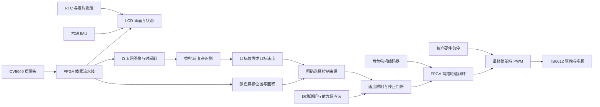

# FPGA 小车扩展板与功能规划

日期：2026-10-04。目标板：ACG720，GW5AT-60B。当前显示屏固定为 1024×600 RGB LCD，摄像头为官方 OV5640。本文是供讨论和画原理图的草案，模块型号、电平、供电和连接器实物尚未全部确认，不能直接按此通电接线。

## 1. 先说清楚：为什么使用 FPGA

如果目标只是“摄像头识别人，香橙派算结果，下位机驱动两台电机”，香橙派直接连接摄像头和屏幕、配合 STM32，完全是合理方案。不能把绕经 FPGA 的显示、网口转发或多接几个传感器本身当成优势。STM32 也有硬件 PWM、编码器计数和定时器，见 [ST 定时器文档](https://wiki.st.com/stm32mpu/wiki/TIM_internal_peripheral)。

比赛要求以 FPGA 为主体，这决定了我们要研究 FPGA 能承担什么，并不证明它一定是这类消费产品的成本最优解。要区分“适合研究和比赛”“系统中确有作用”和“市场上最划算”。闹钟、音箱和更多接口可以增加实用性，不能代替性能证据。

建议将主线改为：**FPGA 能独立完成简单视觉任务和移动闭环，香橙派增加复杂的目标识别能力。**不是预先宣称比其他方案快，而是先做出可测量的硬件处理路径。

| 候选能力 | FPGA 具体做什么 | 实际用途与限制 |
| --- | --- | --- |
| 简单目标定位 | 对摄像头像素做颜色分割，统计目标区域、面积、中心位置 | 可跟随颜色标记、定位红色目标；不能把“红色区域”称作“识别了水瓶”，也不能保证在杂乱背景中正确选中目标 |
| 独立跟随闭环 | 目标水平偏差产生转向意图，前方测距限制速度，两路编码器反馈轮速 | 在不依赖香橙派视觉推理的模式下运行；目标丢失、数据过期时停止，而不是盲走 |
| 并行执行 | 像素处理、编码器计数、各传感器接口、PWM、LCD、网络各自运行 | 是否在视频/网络满负载时仍保持控制周期，需要实测；不是 MCU 不能并行，也不是零延迟 |
| 图像与传感器时间对应 | 给帧、距离、轮速打统一时间戳，记录数据有效性 | 帮助判断目标画面和障碍物距离是不是同一时刻附近的数据；传感器内部测量周期仍由模块决定 |
| 输出仲裁 | 识别结果不能直接绕过急停、测距异常和速度上限驱动电机 | 与独立硬件禁能结合，提高失联时行为的可预测性；这也是 MCU 可做的功能，不单独作为 FPGA 独有优势 |

现有高斯滤波是实际像素流水线，可以继续复用。但为了检测效果而不断叠加滤波不一定有益：用于 AI 的彩色图像和用于硬件颜色定位/调试的分支应明确区分，并记录处理配置。颜色阈值应在实拍光照下标定。

800×480、30 帧/秒的 RGB565 有效图像数据为 23.04 MB/s；400×240、30 帧/秒为 5.76 MB/s，未计空白和协议开销。这是计算示例，不是当前所有链路的实测吞吐。逐像素流水线是 FPGA 值得研究的部分，数值不能证明它已经超过香橙派或某款 STM32。

建议系统关系如下（Typora 可开启 Mermaid 渲染）：

硬件颜色模式只在明确选择并启动后运行。香橙派模式下，指令超时就停止；不能因网络断开而自动切换到另一个运动来源。切换模式、释放急停和重新上电都应重新确认启动。

## 2. 如何证明价值，避免自欺欺人

先给出测试条件和结果，再写性能结论。建议记录以下项目：

| 测试 | 要记录什么 | 能说明什么 |
| --- | --- | --- |
| 颜色定位路径 | 从曝光/帧到坐标输出的时序、帧率、错误选中情况 | FPGA 是否真正承担定位计算。逐帧面积/中心统计通常要等帧结束，不能声称微秒级完整识别 |
| 控制周期 | 例如以 1 kHz 作为初始设计目标，记录轮速控制更新间隔和抖动 | 固定周期控制是否实现；1 kHz 不保证机械系统有相同响应速度，参数需实测调节 |
| 并发负载 | 视频+网口打开/关闭时的编码器丢计数、控制周期、轮速误差 | 这些硬件模块运行是否受到图像负载影响 |
| 停止行为 | 有效障碍事件/指令超时到 PWM 与使能变化，以及车轮实际停下的时间 | 数字输出停止与机械刹停是两种指标；传感器采样周期、惯性、驱动状态都影响后者 |
| 对照方案 | 同摄像头、同算法、同分辨率、同功耗/成本统计方法 | 若要宣称优于香橙派或 STM32，必须有可比实测；只展示本方案不够 |

目前没有上述对照数据，所以只可描述设计和已实现的功能。即使测试后发现 MCU 同样能胜任，也应如实报告。项目仍可以展示硬件流水线、资源开销和可预测控制，但不夸大性价比。

## 3. 40＋4＋8＋16 不是 68 个数字 GPIO

依据官方《ACG720-138&60K通用原理图》第 1、3、7、8、11、12、15 页，以及《高云 ACG720-138&60K通用管脚分配表.xlsx》Sheet1 GPIO0 的 A219:F254。接插件总脚数包含电源、地、模拟信号和未连接脚。

| 接口 | 实际信号 | 扩展板处理 |
| --- | --- | --- |
| P7，40 针 | 36 个 GPIO、5V、3V3、两个 GND | 作为主要数字接口，36 根信号全部保留直通/测试点 |
| P3，4 针 | 两路 DAC 模拟输出、两个 AGND | 单独标为模拟输出，不接数字传感器或电机 |
| P5，16 针 | 八路 ADC 模拟输入、八个 AGND | 每路按“模拟输入＋AGND”分组；需要分压/放大/保护的前端另画 |
| P8，8 针 | USER0/1/2、5V、3V3、两个 GND、一根未标功能脚 | 可预留连接器，不将未知脚计入本期可用 IO |
| P6，8 针 | GPIO Bank 的 VCCIO 电压选择跳帽 | 保留选择功能，不当传感器接插件 |

P8 按原理图为：1=5V，2=GND，3=USER0，4=USER2，5=USER1，6=未标功能，7=3V3，8=GND。USER2 可见 H20；USER0/1 的 FPGA 端映射尚未可靠核实，本期不使用。第 6 脚不是可随意分配的 IO。

**纠正旧说明：本版官方资料中，P7 GPIO0 在 BANK2，HDMI 在 BANK7，球位没有重叠。此前“GPIO0 与 HDMI 共用”的说法没有依据，应撤回。**同时使用时仍要计算时钟、逻辑资源和视频带宽，但不存在已发现的这两组球位冲突。

GPIO0 的电压不是固定 3.3V：BANK2 的 VCCO_2 接 VCCIO，P6 可选 3.3/2.5/1.8/1.5V。按图 P6 的 7—8 跳帽选择 3.3V；实物 Pin1 方向、板卡修订和跳帽位置还需确认，并用万用表核对 TP5。软件设置 LVCMOS33 不会把错误的硬件供电自动变成 3.3V。

## 4. 本期信号预算与 P7 建议分配

以下假设四个激光均为 TTL UART、IMU 为 I²C＋中断、编码器为 A/B。这只是 FPGA 侧逻辑分配；模块实际线序、供电和方向转换要等手册。若激光是 I²C 同地址模块、IMU 是 SPI、编码器带 Z 相，应重新计算。

| 功能 | 数字信号数 |
| --- | ---: |
| 四个激光，每路 TX/RX | 8 |
| 超声波 TRIG/ECHO | 2 |
| 六轴 IMU SCL/SDA/INT | 3 |
| TB6612 两路 PWM、四路方向、STBY | 7 |
| 两台电机 A/B 编码器 | 4 |
| 外接急停反馈 | 1 |
| 调试串口 TX/RX | 2 |
| 本期合计 | **27** |
| 两个步进驱动器 STEP/DIR/EN 预留 | 6 |
| 预留后合计 | **33，剩余 3** |

如果采用两路普通 PWM 舵机，控制只占两根数字 IO，电源/地不算 IO，本期加云台共 29 根。舵机与步进驱动器不是同一种接线，预留口需适配。四角测距不等于完整环境建图，六轴 IMU 也不能提供不漂移的绝对航向。

**P7 已与当前 lcd_interaction.cst 逐项核对，下面 36 根球位没有被 LCD、GT911、摄像头、DDR3、网口和 LED 占用。**这不替代实物接插件方向和电气检查。不要套用其他板卡“1/2 是电源”的规则：本板电源在 11/12 和 29/30。

TX/RX 名称全部从 FPGA 角度看：FPGA_TX 接模块 RX，FPGA_RX 接模块 TX。

| P7 脚 | GPIO0 | 60K 球位 | 建议用途 |
| ---: | ---: | --- | --- |
| 1 | 0 | A13 | 激光 1 FPGA_TX |
| 2 | 1 | A14 | 激光 1 FPGA_RX |
| 3 | 2 | A15 | 激光 2 FPGA_TX |
| 4 | 3 | A16 | 激光 2 FPGA_RX |
| 5 | 4 | A18 | 激光 3 FPGA_TX |
| 6 | 5 | A19 | 激光 3 FPGA_RX |
| 7 | 6 | F13 | 激光 4 FPGA_TX |
| 8 | 7 | F14 | 激光 4 FPGA_RX |
| 9 | 8 | E13 | 超声波 TRIG |
| 10 | 9 | E14 | 超声波 ECHO，电平待确认 |
| 11 | — | — | 板载 5V，不能当信号脚 |
| 12 | — | — | GND |
| 13 | 10 | C13 | IMU SCL |
| 14 | 11 | B13 | IMU SDA |
| 15 | 12 | D14 | IMU INT |
| 16 | 13 | D15 | TB6612 AIN1 |
| 17 | 14 | C14 | TB6612 AIN2 |
| 18 | 15 | C15 | TB6612 PWMA |
| 19 | 16 | B15 | TB6612 BIN1 |
| 20 | 17 | B16 | TB6612 BIN2 |
| 21 | 18 | D17 | TB6612 PWMB |
| 22 | 19 | C17 | TB6612 STBY |
| 23 | 20 | E16 | 左轮编码器 A |
| 24 | 21 | D16 | 左轮编码器 B |
| 25 | 22 | B17 | 右轮编码器 A |
| 26 | 23 | B18 | 右轮编码器 B |
| 27 | 24 | C18 | 硬件急停反馈 |
| 28 | 25 | C19 | 调试 FPGA_TX |
| 29 | — | — | 板载 3V3，不能当信号脚 |
| 30 | — | — | GND |
| 31 | 26 | F16 | 调试 FPGA_RX |
| 32 | 27 | E17 | 云台轴 1 STEP，或舵机 PWM |
| 33 | 28 | D20 | 云台轴 1 DIR，或预留 |
| 34 | 29 | C20 | 云台轴 1 EN，或预留 |
| 35 | 30 | E19 | 云台轴 2 STEP，或舵机 PWM |
| 36 | 31 | D19 | 云台轴 2 DIR，或预留 |
| 37 | 32 | F18 | 云台轴 2 EN，或预留 |
| 38 | 33 | E18 | 备用 1：例如限位输入 |
| 39 | 34 | F19 | 备用 2：例如限位输入 |
| 40 | 35 | F20 | 备用 3：例如独立驱动器故障输入 |

TB6612 不提供一个可任意假定的 FAULT 引脚；表中备用 3 仅适用于将来确实有故障输出的其他驱动器。方向、电机停止方式和禁能时序应按实际模块设计。

## 5. 扩展板怎样分组，方便接线和迭代

第一版采用“信号转接＋电平适配＋接插件＋电源分配”。暂时使用已经买好的 TB6612 模块，先不自行重画功率驱动器。P7 全部 IO 直通到标号清楚的测试/备用位置，再分到有用途的 4Pin/6Pin 接口。两处接插件连着同一信号不等于增加了一个 IO，不能同时接两个主动输出。

| 接口组 | 建议接插件 | 信号分组，尚非模块线序 |
| --- | --- | --- |
| 四角激光 ×4 | 每路 4Pin 防反插 | 模块供电、GND、FPGA_TX、FPGA_RX |
| 正前方超声波 | 4Pin 防反插 | 模块供电、GND、TRIG、ECHO |
| IMU | 6Pin | 供电、GND、SCL、SDA、INT、NC/待定；第六针不虚构 RESET |
| 左/右编码器 ×2 | 每路 4Pin | 编码器供电、GND、A、B；电机功率线另走端子 |
| TB6612 左/右控制 | 两组 6Pin 或一个与模块一致的转接座 | 每组逻辑供电、GND、IN1、IN2、PWM、公共 STBY；同一 STBY 只有一个 FPGA 信号 |
| 两轴云台预留 | 每轴 6Pin | 信号侧供电、GND、STEP、DIR、EN、NC；舵机使用单独适配口和电源 |
| 调试串口 | 4Pin | GND、FPGA_TX、FPGA_RX、NC；避免 USB 串口电源向板卡倒灌 |
| 硬件急停 | 4Pin 或适配实际开关的端子 | 硬件禁能回路和状态反馈回路；按选定开关触点定义线序 |
| ADC | 八组 2Pin，可组织成四组 4Pin | 每路模拟输入与 AGND，明确 0～3.3V 范围 |
| DAC | 一组 4Pin | 两路模拟输出及各自 AGND；不做大电流驱动 |

这些是功能分组。确认模块后，接线表必须写全“模块脚 → 电平转换/保护 → 扩展板连接器脚 → P7 脚 → FPGA 球位 → Bank 电压 → 上电默认状态”。不能只标 TX、RX 而省略方向。

布局建议：P7 接口和逻辑电路靠近板卡，测距/IMU 接口在一侧，电机电源/驱动/电机端子在另一侧，模拟输入前端避开电机开关电流。避免电机回流穿过 FPGA 或模拟参考地的细线；同时保证需要的共同参考地连续可靠，不能盲目切割地平面。逐项确定连接器间距、正反插方向和安装孔，留出 LCD、摄像头、网线和 SD 插拔空间。

供电、电平须在画原理图前确认：

- FPGA GPIO 不直接接未知的 5V 输出；超声波 ECHO、编码器、激光串口都可能需要适配。I²C 要核对模块上拉电阻接在哪个电压上。
- TB6612 的 VM 是电机电源，VCC 是逻辑电源，两者分清。原厂输入高电平门限为 0.7×VCC；如果 VCC=5V，FPGA 3.3V 不保证被识别，见 [TB6612FNG 原厂手册](https://toshiba.semicon-storage.com/info/docget.jsp?did=10660)。采用 3.3V 逻辑还是电平转换，要看实际模块。
- 电机、舵机供电独立核算，不从 FPGA 排针给大电流负载供电。根据电机堵转电流检查驱动器、导线、接插件、电源和保护器件，不能只看空载额定值。
- 默认使能应为关闭，FPGA 未配置、复位或没有有效命令时也不能运动。硬件急停应能直接撤销驱动许可，不能只依赖 LCD 按钮或串口命令。撤销 STBY 与主动电制动效果不同，实际停车距离要测试。
- 你目前没有万用表，画图和资料核对可以先做，接线和上电前需要借用或准备一块，检查电源、电平和短路。

## 6. 开关、LED、按键和 LCD 怎么发挥作用

不要做“每个开关对应一种随意效果”的功能拼盘，围绕测试、模式和故障解释来用。这些板载资源使用自身的固定连接，不需要占用 P7 的新传感器信号。

| 板载资源 | 建议用途 |
| --- | --- |
| SW0 | 允许运动开关，关闭则禁止运动；不是替代硬件急停 |
| SW1 | FPGA 简单视觉模式 / 香橙派识别模式；切换后重新确认启动 |
| SW2～SW3 | 调试预览选择：原图、灰度、高斯、边缘。AI 发送分支配置需单独记录，不能随意跟着预览改变 |
| SW4 | 图像标记/传感器数值叠加 |
| SW5 | 台架低速限制模式 |
| SW6 | 事件/时序记录开关 |
| SW7 | 定时提醒开关；不设置“关闭安全保护”的开关 |
| S0 | 保留当前全局复位功能 |
| S4 | 保留当前高斯切换功能；之后若改变，应更新 UI、说明和数据配置 |
| S1～S3 | 后续开始/暂停、菜单确认、取消/提醒消音，长短按去抖；具体映射待界面确定 |
| D0～D7 | 后续显示心跳、相机、DDR、通信数据有效、测距有效、轮速控制、目标有效、停止/故障 |

上述是规划，当前 R4 的 LED 诊断含义仍以源码为准，不能假设已经改好。当前 PHY 初始化完成不等于网络已连通，目标被双击也不等于跟踪算法已经接入。

LCD 保持四块不重叠区域：摄像头/目标标记；四角和前方距离；左右目标与实测轮速；模式、数据年龄、停止原因。增加一页“硬件处理调试”，显示原图/分割结果、目标像素数、坐标和流水线状态，比只写“已高斯滤波”更便于验证。

## 7. 闹钟、音箱、SD 和两路 HDMI

### 7.1 闹钟可以做，而且已有适合的硬件

官方原理图第 9 页有两组四位数码管，即**八位数字**，不是只能显示两位。通过两个 74HC595 驱动，FPGA 信号为 SEG7_DIO=M18、SEG7_RCLK=C2、SEG7_SCLK=F4。

同页有 BM8563T RTC 和 CR1220 电池位。教程第 34 章名为《基于I2C接口的PCF8563数字时钟显示》，可以参考读时间、校时、显示逻辑，但实际芯片/寄存器先核对。RTC 的 INT/CLKOUT 没有接 FPGA，时间和报警状态需要轮询；掉电保持取决于实际电池。RTC、EEPROM 和音频配置共用板载 I²C（M13/M16），后续驱动不能各自同时占用总线。

板载无源蜂鸣器 BEEP=N19，已有晶体管驱动。最小功能可以是“时钟/番茄钟＋数码管＋蜂鸣提醒”，无需先买扬声器。官方第 13、19/20、34 章分别提供数码管、蜂鸣器、时钟参考。此功能可先独立验证再整合，但目前尚未加入 R4。声音提醒时小车默认停着，不设计无人确认就追着睡觉的人移动。

### 7.2 会移动的小音箱可做，但需要声音输出设备

原理图第 14 页是 ES8388：蓝色 IN 为线路输入，绿色 OUT 为模拟音频输出，没有独立扬声器功放。可先连接手边带独立供电和功放的 AUX 有源音箱；裸喇叭需要另外的功放和电源，不能直接由 FPGA IO 驱动。MIC1 是两针接口，不代表已经有麦克风。

最实用的声音内容是倒计时结束、靠近障碍、目标丢失和低电量提醒。语音合成/语义识别可由香橙派承担，FPGA 做定时播放、音量/混音或简单音频处理，但这些需要音频传输和 ES8388 配置。复杂语义任务不能因为加了音频口就自动成为 FPGA 功能。

### 7.3 SD 是 microSD/TF，需要驱动和文件系统

第 15 页 J8 是 microSD 插座。未来可放提示音、字体、配置和日志；插卡本身不会自动支持 MP3 或录像。先考虑 PCM/WAV 提示音，比在 FPGA 上新增 MP3 解码省工。日志第一版直接发到香橙派存储，后续再实现 SD 写入。

### 7.4 HDMI 保留为大屏调试输出，不是通用传感器接口

第 7、8 页都是 FPGA TMDS 输出，带 ESD、上拉、电源开关和 DDC 电平转换，没有 HDMI 接收器。它们适合接显示器、投影仪或采集卡作视频输出；本项目不用改屏，也不建议通过 HDMI 插座接激光、电机等普通模块。

软件可复用已有像素生成逻辑，但仍要加 TMDS、时钟、串化和正确约束。以后比赛展示时可在借来的大屏上显示处理对比和传感器调试页。两口都空着没有问题，不需要为了“用满板子”购买两块屏。

### 7.5 ADC 可以服务电池和电机状态，而非硬加示波器

第 15 页 ADC128S102 的模拟供电为 3.3V，因此按图正常输入为 0～3.3V；八通道是轮询复用转换，不是八路同时采样。若以后加入电池电压分压、电流传感器/采样放大和必要保护，可检测低电量、过载与堵转征兆。需要模拟前端和实测阈值，不能直接接电池或电机端。第一版先预留模拟接口，待运动稳定再决定是否值得实现。

## 8. 从用户角度选一个用途

建议定位为“跟随的随身提醒/小物品搬运车”：小车在可测试的室内区域跟随，保持距离；用户停下时它停车；可放轻小物品，显示番茄钟或到点提醒；需要时寻找已经训练好的玩偶或颜色目标。

前提是机械承载和防倾倒、跟踪可靠性、避障盲区、距离和停止行为经过验证。没有机械臂就只说搬运预先放上的东西、找到后靠近，不说自动抓取。四角单点测距也不能据此承诺任意室内自主导航。

主功能与优先级：

1. 现在：冻结接插件/供电方案，先验证一个传感器；已通过的图像链路保留。
2. 近期主线：双电机编码器反馈、低速闭环、测距停止、独立急停与超时逻辑。
3. FPGA 功能主线：颜色定位分支、硬件简单跟随、并发负载与延迟测试。
4. 用户功能：时钟/倒计时＋蜂鸣器；成本和引脚占用低，可独立验证。
5. 后续：香橙派人物/玩偶识别接入、云台、有源音箱、SD、HDMI 大屏调试。

10 月 6 日验收应优先展示真实已跑通链路和可验证模块，不承诺几天内补齐所有扩展。没有接通电机时就展示定位坐标、传感器数值和停机使能，不把这些称作已完成移动跟随。

## 9. GitHub 工程：可以学习什么，不能直接照搬什么

已阅读一手仓库说明，下面是参考，不是已经在 ACG720 验证的工程。优先复用本地官方教程的当前板卡驱动；第三方工程的球位、PLL 和 RAM IP 不能直接拿来烧录。

| 工程 | 可借鉴的实际内容 | 移植注意 |
| --- | --- | --- |
| [RT216/fpga-pid_motor](https://github.com/RT216/fpga-pid_motor) | Tang Primer 25K 四路编码器测速、PWM、UART 目标转速、PID | 用高云 3p3z IP，原驱动为 AT8236，需改为实际 TB6612 控制和禁能逻辑；适合研究控制结构 |
| [delhatch/Red_Tracker](https://github.com/delhatch/Red_Tracker) | FPGA 检测红色区域，找最大区域中心并显示十字线 | Cyclone IV＋D8M，不是本板 OV5640；舵机控制只是作者列的后续想法，不是现成完整跟随车 |
| [iharbour-heyaonan/FPGA_image_process](https://github.com/iharbour-heyaonan/FPGA_image_process) | 灰度、阈值、Sobel、腐蚀/膨胀等 Verilog 图像模块 | 原用 Vivado/Xilinx 行缓存 IP，需改高云 RAM；本地第 39～43 章已有更接近本板的教学参考 |
| [WangXuan95/FPGA-SDcard-Reader](https://github.com/WangXuan95/FPGA-SDcard-Reader) | SD 原生 1 位模式，读 FAT16/FAT32 文件/扇区 | 是读取器，不能当成已经完成日志/照片写入；后续做声音文件读取时再研究 |
| [Sipeed PT8211 例程](https://github.com/sipeed/TangPrimer-20K-example/tree/main/PT8211) | 高云平台音频 DAC 驱动参考 | 本板是 ES8388，初始化和音频接口要按本地第 35 章适配 |
| [hdl-util/hdmi](https://github.com/hdl-util/hdmi) | HDMI 视频/音频编码输出 | Gowin 支持在其说明中仍标 WIP；不能因为用了 SystemVerilog 就认定能直接用，优先参考本板第 29 章 |

引用代码时保留作者和许可证，并核对 IP 的使用条件。并未下载或合并这些工程到当前项目。

## 10. 下一步需要你给什么，才能开始画板

可以先确定上面的主接口和功能分组，但制造前必须拿到：四个激光、超声波、IMU、TB6612 的模块型号/整板原理图或手册、模块线序照片；电机额定电压、堵转电流、编码器电平/线序/脉冲数/减速比；计划电源规格；P7/P6 及安装空间实物照片和尺寸。

按这个顺序做：模块接口/电平表 → 单模块测试接线 → 完整 P7 与连接器分配 → 电源与急停原理图 → 机械尺寸与 PCB 布局 → 制造前检查 → 空载/悬空低速电机验证。未知模块型号时，可以画连接器框架，不能冻结电平转换、功率部分和最终线序。

第一版尽量保留 36 根数字信号、模拟输入输出和备选 USER 连接位置，但把它们分开标识。扩展空间来自清楚的接口、电源和机械预留，不来自把不同种类的引脚都称作 GPIO。
